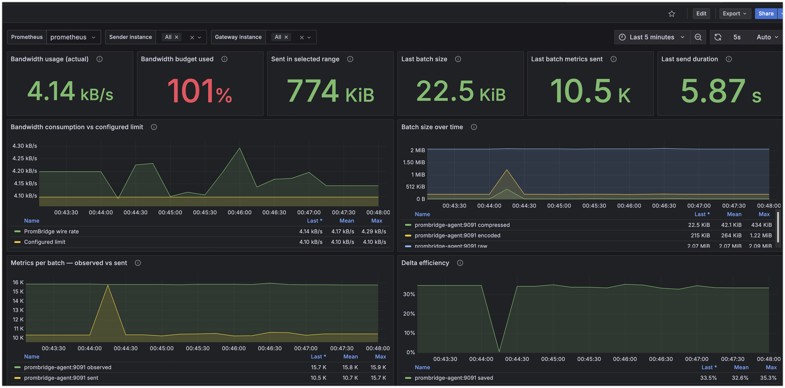
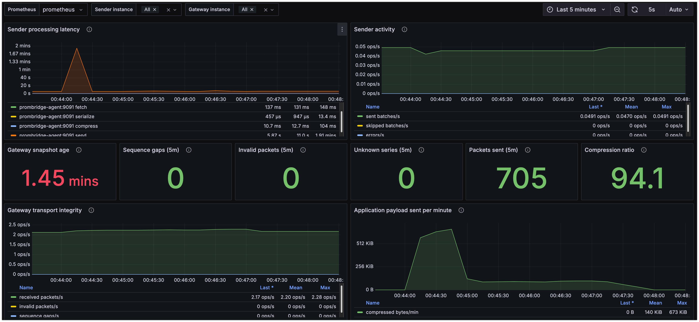

# PromBridge v2.3.1

PromBridge is a bandwidth-controlled bridge for transporting selected
Prometheus metrics over authenticated UDP from a source environment to a
Prometheus-compatible receiver.

It is intended for environments where normal Prometheus connectivity is
unavailable or undesirable, especially bandwidth-constrained and
air-gapped networks.

PromBridge v2.3.1 consists of two main components:

-   **PromBridge Agent / Sender** --- reads metrics from Prometheus
    `/federate`, filters them, tracks changes, compresses the resulting
    batches, applies bandwidth shaping, and sends authenticated UDP
    datagrams.
-   **PromBridge Gateway / Receiver** --- validates and reassembles UDP
    messages, reconstructs the current metric state, and exposes it
    through a standard HTTP `/metrics` endpoint.

The downstream Prometheus server scrapes the Gateway exactly like any
other Prometheus exporter.

------------------------------------------------------------------------

## 1. Architecture

``` text
                    SOURCE ENVIRONMENT
                    ==================

 Exporters / Applications
          |
          v
 +-------------------+
 |    Prometheus     |
 |    /federate      |
 +---------+---------+
           |
           | HTTP
           v
 +----------------------------+
 | PromBridge Agent / Sender  |
 |                            |
 | job filter                 |
 | metric filter              |
 | delta tracking             |
 | binary encoding            |
 | gzip compression           |
 | bandwidth shaping          |
 | HMAC authentication        |
 +-------------+--------------+
               |
               | authenticated UDP
               | default allocation: 4096 B/s
               v

                    DESTINATION ENVIRONMENT
                    =======================

 +-----------------------------+
 | PromBridge Gateway/Receiver |
 |                             |
 | packet validation           |
 | message reassembly          |
 | decompression               |
 | current-state cache         |
 +-------------+---------------+
               |
               | HTTP /metrics
               v
 +-------------------+
 |    Prometheus     |
 +---------+---------+
           |
           v
 +-------------------+
 |      Grafana      |
 +-------------------+
```

The UDP transport is one-way. The Sender does not require a TCP
connection to the destination Gateway.

------------------------------------------------------------------------

## 2. Design Goals

PromBridge is designed to provide:

-   Prometheus metric transport over UDP;
-   strict control of PromBridge bandwidth consumption;
-   selection of only required Prometheus jobs and metric families;
-   delta transmission instead of repeatedly sending unchanged values;
-   bounded queues instead of an ever-growing backlog;
-   authenticated UDP packets using a shared secret;
-   fragmentation and reassembly of messages larger than a single UDP
    datagram;
-   Prometheus-native output at the destination;
-   observability of the transport itself.

The default Sender bandwidth limit is:

``` text
4096 bytes/second
```

This is **4 KiB/s** of PromBridge UDP datagram data.

The limiter includes the PromBridge packet envelope and HMAC. It does
**not** include Ethernet framing or other lower-layer network overhead.

------------------------------------------------------------------------

## 3. Requirements

### Sender side

The Sender requires:

-   a Prometheus server reachable from the PromBridge Agent;
-   access to the Prometheus `/federate` endpoint;
-   UDP connectivity from the Agent to the Gateway;
-   the same `PUR_SECRET` configured on Sender and Receiver.

The provided Sender container is Linux/amd64.

### Receiver side

The Receiver requires:

-   an exposed UDP port, normally `19090`;
-   an HTTP port, normally `8080`;
-   the same `PUR_SECRET` as the Sender;
-   a Prometheus server capable of scraping the Receiver `/metrics`
    endpoint.

The provided Helm chart is intended for Kubernetes/RKE2-style
deployments and can expose UDP through a NodePort. The v2.3.1 chart defaults
match the current Receiver Docker baseline (10s idle reassembly timeout, 8 MiB
compressed limit, 64 MiB uncompressed limit, 65507-byte packet limit, and 4 MiB
UDP receive buffer).

------------------------------------------------------------------------

## 4. Security

PromBridge uses a shared secret supplied through:

``` text
PUR_SECRET
```

The secret is used to authenticate PromBridge UDP packets.

**Do not commit the real secret to Git.**

For Docker Compose, inject it through an environment file,
secret-management mechanism, or deployment automation.

For Kubernetes, use an existing Secret:

``` yaml
secret:
  existingSecret: prombridge-secret
```

Sender and Receiver must use exactly the same secret.

------------------------------------------------------------------------

# Installation

## 5. Build the Images

Sender:

``` bash
docker build \
  -f Dockerfile.sender \
  -t prombridge-agent:2.3.1 .
```

Receiver:

``` bash
docker build \
  -f Dockerfile.receiver \
  -t prombridge-gateway:2.3.1 .
```

For an air-gapped environment, export the images after building:

``` bash
docker save prombridge-agent:2.3.1 \
  -o prombridge-agent_2.3.1.tar

docker save prombridge-gateway:2.3.1 \
  -o prombridge-gateway_2.3.1.tar
```

Import them on the destination host or into the internal registry
according to the local air-gap procedure.

------------------------------------------------------------------------

## 6. Sender Configuration

A typical production Sender configuration is:

``` yaml
services:
  prombridge-agent:
    image: prombridge-agent:2.3.1
    container_name: prombridge-agent
    restart: unless-stopped

    environment:
      PUR_SECRET: "REPLACE_WITH_SHARED_SECRET"

    command:
      - "--source-url=http://prometheus:9090/federate"

      - '--job-regex=windows-exporter|custom-exporter'
      - '--metric-regex=windows_.*|application_metric_.*'

      - "--startup-mode=current"
      - "--send-mode=delta"

      - "--dest-host=REPLACE_WITH_GATEWAY_IP"
      - "--dest-port=31909"

      - "--interval=15s"
      - "--mtu=1200"
      - "--packet-delay=1ms"

      - "--compression=gzip-best"
      - "--full-sync-interval=5m"
      - "--snapshot-queue=1"

      - "--max-bandwidth-bytes-per-second=4096"

      - "--metrics-listen=:9091"
      - "--udp-send-buffer-bytes=4194304"
      - "--http-timeout=30s"
      - "--max-body-bytes=67108864"

    ports:
      - "9091:9091"
```

If Prometheus runs on the Docker host instead of the same Compose
network, a source URL such as the following can be used where supported:

``` text
http://host.docker.internal:9090/federate
```

------------------------------------------------------------------------

## 7. Selecting Prometheus Jobs

`--job-regex` filters metrics by the Prometheus `job` label.

Examples:

``` text
--job-regex=windows-exporter
--job-regex='windows-exporter|custom-exporter'
--job-regex='windows-.*'
--job-regex='.+' 
```

`.+` selects all jobs.

Series without a `job` label are excluded when job filtering is applied.

PromBridge passes the job selector to `/federate` and also applies the
filter locally.

------------------------------------------------------------------------

## 8. Selecting Metric Families

`--metric-regex` filters metric names after job filtering.

Example:

``` text
--metric-regex='windows_.*'
```

Multiple families:

``` text
--metric-regex='windows_.*|my_application_.*'
```

A more restrictive allow-list can be used when bandwidth is limited:

``` text
--metric-regex='up|windows_cpu_time_total|windows_memory_physical_free_bytes|windows_memory_physical_total_bytes|windows_logical_disk_free_bytes|windows_logical_disk_size_bytes|windows_net_current_bandwidth_bytes|windows_net_bytes_received_total|windows_net_bytes_sent_total|windows_net_packets_received_errors_total|windows_net_packets_received_total|windows_net_packets_outbound_errors_total|windows_net_packets_sent_total'
```

The metric allow-list should be defined from the actual monitoring
requirements. Avoid transmitting metric families that are not required
at the destination.

------------------------------------------------------------------------

# Delta Transport

## 9. Delta Mode

Recommended mode:

``` text
--send-mode=delta
```

For every Prometheus federation fetch, the Agent compares the current
metric state with the previous state.

It sends only:

-   newly observed series;
-   series whose value changed;
-   tombstones for previously transmitted series that disappeared.

Unchanged series remain cached at the Gateway and do not need to be
transmitted again.

Example:

``` text
samples_observed=6776
samples_sent=317
samples_unchanged=6459
```

In this example Prometheus returned 6,776 series, but only 317 changed
and required transmission.

This is the main mechanism that reduces PromBridge bandwidth
consumption.

### Snapshot mode

Legacy snapshot behavior is available with:

``` text
--send-mode=snapshot
```

Snapshot mode sends all current samples every interval and normally
consumes considerably more bandwidth.

------------------------------------------------------------------------

## 10. Startup Modes

### `startup-mode=full`

``` text
--startup-mode=full
```

The first successful federation fetch is transmitted immediately as a
complete state.

Use this when the Gateway must receive the current metric state
immediately after the Sender starts.

### `startup-mode=current`

``` text
--startup-mode=current
```

The first successful federation fetch establishes a local baseline only.

Nothing is transmitted for that initial baseline.

Subsequent changes, newly appearing series, and deletions are
transmitted normally.

This is useful on highly constrained links because restarting the Agent
does not automatically generate a potentially large initial transfer.

A baseline-only series is not published to the Gateway until it changes.

------------------------------------------------------------------------

## 11. Periodic Reconciliation

The default configuration uses:

``` text
--full-sync-interval=5m
```

The periodic reconciliation refreshes the state that is eligible for
transmission.

There is an important distinction between the startup modes:

-   with `startup-mode=full`, reconciliation can include the complete
    current state;
-   with `startup-mode=current`, baseline-only series that have never
    been transmitted are not resurrected by reconciliation.

This behavior is intentional.

------------------------------------------------------------------------

# Bandwidth Control

## 12. Hard Bandwidth Limit

The Sender supports:

``` text
--max-bandwidth-bytes-per-second=4096
```

`4096` means 4096 bytes/s, or 4 KiB/s.

The bandwidth shaper paces UDP datagrams so that large batches are
spread over time instead of being emitted as an unrestricted burst.

For example, a message of approximately 300 KB can legitimately require
more than one minute to transmit through a 4096 B/s allocation.

Setting the value to `0` disables shaping.

### Important

A configured 4 KiB/s PromBridge allocation does not mean the physical
network itself is limited to 4 KiB/s. It means PromBridge is allowed to
consume approximately that amount of UDP payload bandwidth.

------------------------------------------------------------------------

## 13. Queue Behavior Under Saturation

The default configuration is:

``` text
--interval=15s
--snapshot-queue=1
```

If a large message takes longer than one collection interval to
transmit, new snapshots can arrive while the previous one is still being
sent.

PromBridge uses a bounded queue instead of accumulating unlimited stale
snapshots.

When the queue is full, the queued snapshot is replaced by a newer one.

The Sender reports this as:

``` text
event=snapshot_queue_replaced reason=queue_full
```

This behavior is expected during saturation and prevents unbounded
backlog growth.

The metric:

``` text
pur_sender_snapshots_skipped_total
```

should be monitored to identify sustained queue pressure.

------------------------------------------------------------------------

# UDP Transport

## 14. Fragmentation

The default maximum PromBridge datagram size is:

``` text
--mtu=1200
```

Messages larger than this are split into multiple authenticated UDP
fragments.

A large transfer may therefore appear as:

``` text
packets=250
```

The Receiver reconstructs the original compressed message before
decoding it.

------------------------------------------------------------------------

## 15. Reassembly Timeout

Receiver configuration:

``` text
--reassembly-timeout=10s
```

In v2.3.1 this value is an **idle/progress timeout**, not a maximum
total transfer duration.

This distinction is important when bandwidth shaping is enabled.

For example, with a 4096 B/s bandwidth limit, a large message may
require 60--90 seconds to arrive. The Receiver will keep that message as
long as new fragments continue to arrive within the configured
reassembly timeout.

A message is discarded only when fragment progress stops for longer than
the configured timeout.

This behavior was specifically corrected in v2.3.1.

------------------------------------------------------------------------

## 16. Receiver Installation with Docker Compose

For a non-Kubernetes destination, the Receiver can run as a normal Docker
container. This is also the simplest layout for a development or lab setup.

Example Compose service:

``` yaml
services:
  prombridge_receiver:
    image: prombridge-gateway:2.3.1
    container_name: prombridge_receiver
    restart: unless-stopped

    environment:
      PUR_SECRET: "REPLACE_WITH_SHARED_SECRET"

    ports:
      - "19090:19090/udp"
      - "8080:8080/tcp"

    command:
      - "--udp-listen=:19090"
      - "--http-listen=:8080"
      - "--reassembly-timeout=10s"
      - "--max-compressed-bytes=8388608"
      - "--max-uncompressed-bytes=67108864"
      - "--max-packet-bytes=65507"
      - "--udp-receive-buffer-bytes=4194304"
      - "--preserve-source-timestamps=false"
```

The `10s` reassembly timeout is an **idle/progress timeout** in v2.3.1. A
large bandwidth-shaped message may therefore take much longer than 10 seconds
in total; it remains valid while fragments continue to arrive.

Start and validate the Receiver:

``` bash
docker compose up -d prombridge_receiver
docker logs -f prombridge_receiver
curl http://localhost:8080/healthz
curl http://localhost:8080/metrics
```

### Sender settings for a Docker Receiver

If Sender and Receiver are on the same Docker Compose network, address the
Receiver by its Compose service name:

``` text
--dest-host=prombridge_receiver
--dest-port=19090
```

Do **not** use `127.0.0.1` from the Sender container; that address refers to
the Sender container itself.

If the Receiver runs on another host, use that host's reachable IP/DNS name:

``` text
--dest-host=<RECEIVER_HOST_OR_IP>
--dest-port=19090
```

Allow `19090/UDP` through any host/network firewall. Port `8080/TCP` only
needs to be reachable by the destination Prometheus server and operators that
need the health/metrics endpoint. Sender and Receiver must use the same
`PUR_SECRET`.

------------------------------------------------------------------------

## 17. Receiver Installation with Helm

Example values:

``` yaml
image:
  repository: registry.internal.example/monitoring/prombridge-gateway
  tag: "2.3.1"
  pullPolicy: IfNotPresent

secret:
  existingSecret: prombridge-secret

receiver:
  udpPort: 19090
  httpPort: 8080
  reassemblyTimeout: 10s
  maxCompressedBytes: 8388608
  maxUncompressedBytes: 67108864
  maxPacketBytes: 65507
  udpReceiveBufferBytes: 4194304
  preserveSourceTimestamps: false

udpService:
  type: NodePort
  port: 19090
  nodePort: 31909
  externalTrafficPolicy: Cluster

metricsService:
  port: 8080

serviceMonitor:
  enabled: true
  interval: 15s
  scrapeTimeout: 10s
  path: /metrics
  honorLabels: true
  labels:
    release: prometheus
```

Install:

``` bash
helm upgrade --install prombridge \
  ./helm/prometheus-udp-relay \
  --namespace prometheus \
  --create-namespace \
  --values values.yaml
```

Validate:

``` bash
kubectl -n prometheus get pods
kubectl -n prometheus get svc
kubectl -n prometheus get endpoints
kubectl -n prometheus get servicemonitor
```

Follow Receiver logs:

``` bash
kubectl -n prometheus logs \
  -l app.kubernetes.io/instance=prombridge \
  -f
```

The UDP NodePort in the example is:

``` text
31909/UDP
```

The Sender must therefore use:

``` text
--dest-host=<RKE2_NODE_IP>
--dest-port=31909
```

For Helm deployments, the important mapping is:

``` text
Sender UDP destination -> Node IP : udpService.nodePort
Service target          -> Receiver pod : receiver.udpPort
Prometheus scrape       -> <release>-prometheus-udp-relay-metrics : metricsService.port
```

Before installation, configure at minimum:

- `image.repository` and `image.tag` for the registry available to the cluster;
- `secret.existingSecret` (recommended) or `secret.value`;
- `udpService.nodePort` if a fixed externally approved UDP port is required;
- `serviceMonitor.enabled` and any selector labels required by the installed Prometheus Operator.

Example Secret creation:

``` bash
kubectl -n prometheus create secret generic prombridge-secret \
  --from-literal=PUR_SECRET='REPLACE_WITH_SHARED_SECRET'
```

For an air-gapped cluster, import/push `prombridge-gateway:2.3.1` into the
internal registry first and point `image.repository` at that registry.

------------------------------------------------------------------------

## 18. Downstream Prometheus

The Receiver exposes reconstructed metrics through:

``` text
http://<receiver>:8080/metrics
```

With Prometheus Operator, enable the ServiceMonitor.

For a standard Prometheus configuration:

``` yaml
scrape_configs:
  - job_name: "prombridge_receiver"
    static_configs:
      - targets:
          - "prombridge_receiver:8080"
```

For delta mode, the recommended Receiver setting is:

``` text
--preserve-source-timestamps=false
```

The downstream Prometheus then assigns the Gateway scrape time to
exposed samples instead of retaining stale timestamps from the original
source scrape.

------------------------------------------------------------------------

# Observability

## 18. Sender Self-Metrics

The Sender exposes its own metrics on:

``` text
:9091/metrics
```

when configured with:

``` text
--metrics-listen=:9091
```

Important Sender metrics include:

``` text
pur_sender_snapshots_total
pur_sender_snapshots_skipped_total
pur_sender_errors_total
pur_sender_packets_total

pur_sender_raw_bytes_total
pur_sender_encoded_bytes_total
pur_sender_compressed_bytes_total

pur_sender_samples_observed_total
pur_sender_samples_sent_total

pur_sender_last_raw_bytes
pur_sender_last_encoded_bytes
pur_sender_last_compressed_bytes

pur_sender_last_samples_observed
pur_sender_last_samples_sent

pur_sender_last_success_timestamp_seconds

pur_sender_last_fetch_duration_seconds
pur_sender_last_serialization_duration_seconds
pur_sender_last_compression_duration_seconds
pur_sender_last_send_duration_seconds

pur_sender_bandwidth_bytes_per_second
pur_sender_bandwidth_limit_bytes_per_second
```

Two particularly important bandwidth metrics are:

``` text
pur_sender_bandwidth_bytes_per_second
pur_sender_bandwidth_limit_bytes_per_second
```

Use these for actual shaped bandwidth and configured budget.

Do **not** infer the instantaneous shaped wire rate only from:

``` promql
rate(pur_sender_compressed_bytes_total[...])
```

Completed batches can make that calculation appear to exceed the
configured limit even though packet pacing is working correctly.

------------------------------------------------------------------------

## 19. Receiver Self-Metrics

The Receiver exposes transport and reconstructed metrics through its
HTTP endpoint.

Important Receiver transport metrics include:

``` text
pur_receiver_packets_total
pur_receiver_invalid_packets_total
pur_receiver_snapshots_total
pur_receiver_unknown_series_total
pur_receiver_sequence_gaps_total

pur_receiver_snapshot_age_seconds
pur_receiver_snapshot_bytes

pur_receiver_wire_bytes_total
pur_receiver_bandwidth_bytes_per_second
```

The following should normally remain zero:

``` text
pur_receiver_invalid_packets_total
pur_receiver_unknown_series_total
pur_receiver_sequence_gaps_total
```

A temporary non-zero rate panel in Grafana can remain visible until its
PromQL time window expires after an older failure. Always compare the
dashboard with current Receiver logs and the underlying cumulative
counter.

------------------------------------------------------------------------

## 20. Grafana Dashboard

The repository contains PromBridge dashboard JSON files under:

``` text
dashboards/
```

For v2.3.1 use the dashboard version containing the corrected bandwidth
queries.

The important panels include:

-   actual PromBridge bandwidth usage;
-   configured PromBridge bandwidth limit;
-   bandwidth budget percentage;
-   sender and receiver activity;
-   observed versus transmitted samples;
-   delta efficiency;
-   overall reduction ratio;
-   packet counts;
-   last send duration;
-   Gateway snapshot age;
-   invalid packets;
-   sequence gaps;
-   unknown series.

Under sustained transmission with a 4096 B/s limit, the expected values
are approximately:

``` text
Bandwidth usage        ~4.10 kB/s
Configured limit       ~4.10 kB/s
Bandwidth budget used  ~100%
```

The exact display unit depends on Grafana formatting.

------------------------------------------------------------------------

# Operational Validation

## 21. Basic Health Check

### Sender

Check startup:

``` bash
docker logs prombridge-agent
```

Expected:

``` text
event=sender_started
event=sender_metrics_started
```

With `startup-mode=current`, the first successful fetch should show:

``` text
event=startup_baseline_initialized
```

Then successful delta transmissions should show:

``` text
event=snapshot_sent
```

### Receiver

Expected:

``` text
event=receiver_started
event=snapshot_receive_started
event=snapshot_accepted
```

A healthy accepted snapshot should normally contain:

``` text
unknown_series=0
```

------------------------------------------------------------------------

## 22. Validate the Sender Metrics Endpoint

``` bash
curl http://localhost:9091/metrics
```

Check:

``` text
pur_sender_last_success_timestamp_seconds
pur_sender_errors_total
pur_sender_bandwidth_bytes_per_second
pur_sender_bandwidth_limit_bytes_per_second
```

------------------------------------------------------------------------

## 23. Validate the Receiver

``` bash
curl http://<receiver>:8080/metrics
```

Confirm that expected source metrics are present.

Also verify:

``` text
pur_receiver_invalid_packets_total
pur_receiver_unknown_series_total
pur_receiver_sequence_gaps_total
```

------------------------------------------------------------------------

## 24. Validate Prometheus Targets

In Prometheus, verify that the PromBridge Receiver target is `UP`.

Example API check:

``` bash
curl -s http://localhost:9090/api/v1/targets
```

The Receiver scrape URL should point to:

``` text
http://<receiver>:8080/metrics
```

If the Sender self-metrics are also scraped, its target should point to
port `9091`.

------------------------------------------------------------------------

# Troubleshooting

## 25. Sender Reports `connection refused`

Example:

``` text
write udp ... connection refused
```

Check:

1.  `--dest-host`;
2.  `--dest-port`;
3.  Receiver container/pod status;
4.  UDP Service or NodePort;
5.  host/network firewall;
6.  Docker network name resolution when Sender and Receiver are
    containers.

Inside a Docker Compose network, use the service name rather than
`127.0.0.1`.

Example:

``` text
--dest-host=prombridge_receiver
```

------------------------------------------------------------------------

## 26. `/federate` Returns `503 Service Unavailable`

A short 503 during Prometheus startup can occur before Prometheus is
ready.

Check:

``` bash
curl http://localhost:9090/-/ready
```

Expected:

``` text
Prometheus Server is Ready.
```

Then validate the federation query directly.

------------------------------------------------------------------------

## 27. `unknown_series` Is Increasing

This means the Receiver received samples referencing Series IDs for
which it does not currently have definitions.

Check:

-   Sender and Receiver are running compatible protocol versions;
-   Receiver was not restarted independently while the Sender retained
    protocol state;
-   no previous reassembly failures occurred;
-   `--reassembly-timeout` is not too small for the maximum gap between
    incoming fragments;
-   current Receiver logs for `unknown_series`.

In v2.3.1 the reassembly timeout is based on **idle time between
progress**, so a bandwidth-shaped message may take longer than the
timeout value in total without being discarded.

After correcting a problem, Grafana panels using a rolling time window
can remain non-zero until the old samples age out.

------------------------------------------------------------------------

## 28. `snapshot_queue_replaced reason=queue_full`

This is not automatically an error.

It means the Sender was still transmitting an older batch when newer
snapshots were generated and the bounded queue replaced an older pending
snapshot.

Occasional replacements during a large synchronization or stress
condition are expected.

Frequent sustained replacements indicate that the generated metric
change rate is higher than the configured PromBridge bandwidth
allocation can carry.

Possible actions:

-   reduce transmitted metric families;
-   reduce metric cardinality;
-   increase `--interval`;
-   increase the PromBridge bandwidth allocation if System Engineering
    permits it.

Do not increase the configured bandwidth above the approved network
allocation without confirming the change with the responsible System
Engineer.

------------------------------------------------------------------------

## 29. Bandwidth Appears Above the Configured Limit

Use:

``` text
pur_sender_bandwidth_bytes_per_second
```

and compare it with:

``` text
pur_sender_bandwidth_limit_bytes_per_second
```

Do not use the rate of completed compressed batches as a substitute for
the shaped wire rate.

For log-level validation:

``` text
wire_bytes / send_duration
```

should be close to the configured shaping limit during a sufficiently
large transfer.

------------------------------------------------------------------------

## 30. No Metrics Are Sent After Startup

With:

``` text
--startup-mode=current
--send-mode=delta
```

this can be correct.

The first scrape establishes a baseline and is intentionally not
transmitted.

If subsequent metrics remain unchanged, no UDP snapshot is required.

Check:

``` text
pur_sender_samples_observed_total
pur_sender_samples_sent_total
pur_sender_snapshots_skipped_total
```

------------------------------------------------------------------------

# System Engineering Notes

## 31. Capacity Planning

PromBridge bandwidth requirements depend primarily on:

-   number of selected series;
-   percentage of series changing each interval;
-   metric label/cardinality size;
-   compression ratio;
-   collection interval;
-   periodic reconciliation behavior;
-   approved bandwidth ceiling.

The raw Prometheus federation response size is **not** equal to the
transmitted UDP size.

PromBridge performs:

``` text
Prometheus text
    |
    v
job/metric filtering
    |
    v
delta selection
    |
    v
binary encoding
    |
    v
gzip compression
    |
    v
authenticated UDP fragments
```

A source federation response of several megabytes can therefore result
in only a few kilobytes of transmitted data when most series are
unchanged.

------------------------------------------------------------------------

## 32. 5-Second vs 15-Second Intervals

Prometheus `/federate` returns the current metric state, not all
historical samples since the previous PromBridge request.

Therefore, in snapshot mode, changing:

``` text
15s -> 5s
```

does not inherently reduce the size of each snapshot. It mainly
increases how often snapshots are transmitted.

In delta mode, a shorter interval may reduce the number of changes per
individual batch, but this is workload-dependent. Counters and
frequently changing gauges can still change on every scrape.

Evaluate interval changes using:

``` text
pur_sender_last_samples_observed
pur_sender_last_samples_sent
pur_sender_last_compressed_bytes
pur_sender_bandwidth_bytes_per_second
```

rather than assuming a shorter interval will save bandwidth.

------------------------------------------------------------------------

## 33. Expected Failure Indicators

The following conditions require investigation:

``` text
pur_sender_errors_total increasing
pur_receiver_invalid_packets_total increasing
pur_receiver_unknown_series_total increasing
pur_receiver_sequence_gaps_total increasing
```

Also investigate sustained growth in:

``` text
pur_sender_snapshots_skipped_total
```

because it can indicate that the approved bandwidth allocation is
insufficient for the current metric churn.

------------------------------------------------------------------------

# Tested v2.3.1 Behavior

## 34. Stress Test

v2.3.1 was validated with approximately:

``` text
~16,800 observed series
~10,400 changing/transmitted series per stressed cycle
4096 B/s bandwidth limit
15s collection interval
1200-byte PromBridge MTU
```

A large test batch produced approximately:

``` text
samples         10,408
definitions     10,107
compressed      284 KB
wire            300 KB
packets         250
send duration   73 seconds
```

The Receiver successfully reassembled the message even though the total
transfer duration was substantially longer than the configured
reassembly timeout.

Observed result:

``` text
unknown series  0
sequence gaps   0
invalid packets 0
```

The measured Sender wire rate remained approximately equal to the
configured 4096 B/s ceiling.

This test validates:

-   bandwidth shaping;
-   long-running fragmented UDP transfer;
-   idle-based reassembly timeout;
-   Series ID/definition synchronization;
-   bounded queue behavior under pressure;
-   Receiver state reconstruction.

------------------------------------------------------------------------

## 35. Regression Expectations

After future changes, repeat at minimum the following checks:

1.  Normal delta operation with low metric churn.
2.  A multi-packet batch.
3.  A bandwidth-shaped transfer whose total duration exceeds
    `reassembly-timeout`.
4.  Queue pressure with `snapshot-queue=1`.
5.  Receiver counters remain at zero for:
    -   invalid packets;
    -   unknown series;
    -   sequence gaps.
6.  Actual Sender wire rate remains at or below the configured bandwidth
    allocation.
7.  Periodic reconciliation completes without corrupting Receiver state.

------------------------------------------------------------------------

# Development and Test Utilities

## 36. Stress Exporter

The repository contains a synthetic Prometheus exporter used to load-test the
PromBridge transport:

``` text
stress-exporter.py
Dockerfile.stress
```

It is **test-only** and is not part of a production PromBridge deployment. Its
purpose is to create thousands of changing time series so that bandwidth
shaping, fragmentation/reassembly, delta behavior, queue pressure, Series-ID
definitions, and Receiver recovery can be tested under conditions that are
much heavier than a normal Windows exporter workload.

Example Compose service:

``` yaml
  stress-exporter:
    build:
      context: .
      dockerfile: Dockerfile.stress
    container_name: prombridge-stress-exporter
    restart: unless-stopped
    environment:
      SERIES_COUNT: "10000"
      PORT: "9183"
    ports:
      - "9183:9183"
```

Add it to the **source Prometheus** scrape configuration:

``` yaml
  - job_name: "custom-exporter"
    static_configs:
      - targets:
          - "stress-exporter:9183"
```

Then allow its synthetic metrics through the Sender for the duration of the
test:

``` text
--job-regex=windows-exporter|custom-exporter
--metric-regex=windows_.*|prombridge_stress_.*
```

Restart/recreate the Sender after changing its command-line arguments:

``` bash
docker compose up -d --force-recreate prombridge-agent
```

Verify that Prometheus sees the stress target and series before judging the
PromBridge result:

``` bash
curl -s http://localhost:9090/api/v1/targets
curl -s 'http://localhost:9090/api/v1/query?query=count({__name__=~"prombridge_stress_.*"})'
```

During a stress run, watch both sides:

``` bash
docker logs -f prombridge-agent
docker logs -f prombridge_receiver
```

Expected behavior at a 4096 B/s ceiling can include long `send_duration`,
multi-packet messages, and `snapshot_queue_replaced reason=queue_full`. Those
are not by themselves failures. The critical checks are that the measured
wire rate remains near/below the configured limit and that, after the system
settles, Receiver `invalid_packets`, `sequence_gaps`, and `unknown_series` do
not continue increasing.

A useful heavy test is `SERIES_COUNT=10000`; this was sufficient in the v2.3.1
lab to push the total observed set to roughly 16.8K series and create transfers
lasting longer than the Receiver's 10-second idle reassembly timeout while
continuous fragment progress kept the message alive.

After testing, remove `prombridge_stress_.*` from `--metric-regex` and stop the
stress exporter:

``` bash
docker compose stop stress-exporter
```

Never leave synthetic stress metrics enabled in production unless they are
explicitly required for an approved test.

------------------------------------------------------------------------

## 37. Build Validation

Run:

``` bash
go test ./...
go vet ./...
```

The v2.3.1 reassembly regression test verifies that a transfer can
remain active longer than `reassembly-timeout` as long as fragment
progress continues.

------------------------------------------------------------------------

# Command-Line Reference

## 38. Sender Options

  ----------------------------------------------------------------------------------------------
  Option                                                           Default Purpose
  ------------------------------------ ----------------------------------- ---------------------
  `--source-url`                         `http://prometheus:9090/federate` Source Prometheus
                                                                           federation endpoint

  `--dest-host`                                                `127.0.0.1` Receiver hostname/IP

  `--dest-port`                                                    `19090` Receiver UDP port

  `--interval`                                                       `15s` Federation fetch
                                                                           interval

  `--mtu`                                                           `1200` Maximum PromBridge
                                                                           UDP datagram size

  `--packet-delay`                                                   `1ms` Additional delay
                                                                           between packets

  `--http-timeout`                                                   `15s` Source HTTP timeout

  `--max-body-bytes`                                              `64 MiB` Maximum federation
                                                                           response size

  `--compression`                                              `gzip-best` `none`, `gzip-fast`,
                                                                           or `gzip-best`

  `--full-sync-interval`                                              `5m` Periodic
                                                                           reconciliation
                                                                           interval

  `--startup-mode`                                                  `full` `full` or `current`

  `--send-mode`                                                    `delta` `delta` or `snapshot`

  `--job-regex`                                                       `.+` Regex for Prometheus
                                                                           `job` label

  `--metric-regex`                                                    `.+` Regex for metric
                                                                           names

  `--max-bandwidth-bytes-per-second`                                `4096` Hard PromBridge UDP
                                                                           shaping limit; `0`
                                                                           disables

  `--snapshot-queue`                                                   `1` Bounded
                                                                           pending-snapshot
                                                                           queue

  `--metrics-listen`                                               `:9091` Sender self-metrics
                                                                           address


  `--udp-send-buffer-bytes`                                        `4 MiB` UDP socket send
                                                                           buffer
                                                                           
  `--match`                                                            --- Additional repeatable
                                                                           federation selector
  
  ----------------------------------------------------------------------------------------------

------------------------------------------------------------------------

## 39. Receiver Options

  -----------------------------------------------------------------------------------
  Option                                                Default Purpose
  -------------------------------- ---------------------------- ---------------------
  `--udp-listen`                                       `:19090` UDP listen address

  `--http-listen`                                       `:8080` HTTP `/metrics`
                                                                address

  `--reassembly-timeout`                                  `30s` Idle timeout for
                                                                incomplete fragmented
                                                                messages

  `--max-compressed-bytes`                             `64 MiB` Maximum compressed
                                                                message size

  `--max-uncompressed-bytes`                          `256 MiB` Maximum decoded batch
                                                                size

  `--max-packet-bytes`                                  `65535` UDP read buffer size

  `--udp-receive-buffer-bytes`                          `8 MiB` UDP socket receive
                                                                buffer

   `--preserve-source-timestamps`                        `false` Preserve original
                                                                sample timestamps
  
  -----------------------------------------------------------------------------------

------------------------------------------------------------------------

# Version Notes

## v2.3.1

-   Reassembly timeout now measures **idle/progress time** instead of
    total message lifetime.
-   Long bandwidth-shaped transfers can exceed the configured timeout in
    total duration as long as fragments continue arriving.
-   Added regression coverage for long shaped transfers.
-   Grafana bandwidth panels use the Sender's measured wire rate and
    configured shaping limit.

## v2.3.0

-   Added metric-name filtering with `--metric-regex`.
-   Added hard bandwidth shaping with
    `--max-bandwidth-bytes-per-second`.
-   Added Sender and Receiver bandwidth observability.
-   Added Windows metric allow-list examples.
-   Added support for a 4 KiB/s PromBridge transport allocation.

Earlier delta/startup functionality includes:

-   `--startup-mode=full|current`;
-   `--job-regex`;
-   `--send-mode=delta|snapshot`;
-   delta state tracking;
-   no-change snapshot suppression;
-   observed-versus-transmitted sample metrics;
-   configurable source timestamp preservation.

------------------------------------------------------------------------

## 40. Recommended Production Baseline

For a bandwidth-constrained deployment, a typical baseline is:

``` text
--interval=15s
--mtu=1200
--packet-delay=1ms
--compression=gzip-best

--startup-mode=current
--send-mode=delta
--full-sync-interval=5m
--snapshot-queue=1

--max-bandwidth-bytes-per-second=4096

--preserve-source-timestamps=false    # Receiver
```

`startup-mode=current` is useful when restart-time bandwidth is more
important than immediately republishing every pre-existing unchanged
series.

If complete current state must be republished immediately after every
Sender restart, use:

``` text
--startup-mode=full
```

instead.

The final job filter, metric allow-list, interval, and bandwidth
allocation must be selected according to the monitoring requirements and
network limits approved for the target environment.

## 41. Dashboard example

### Transport and bandwidth overview




